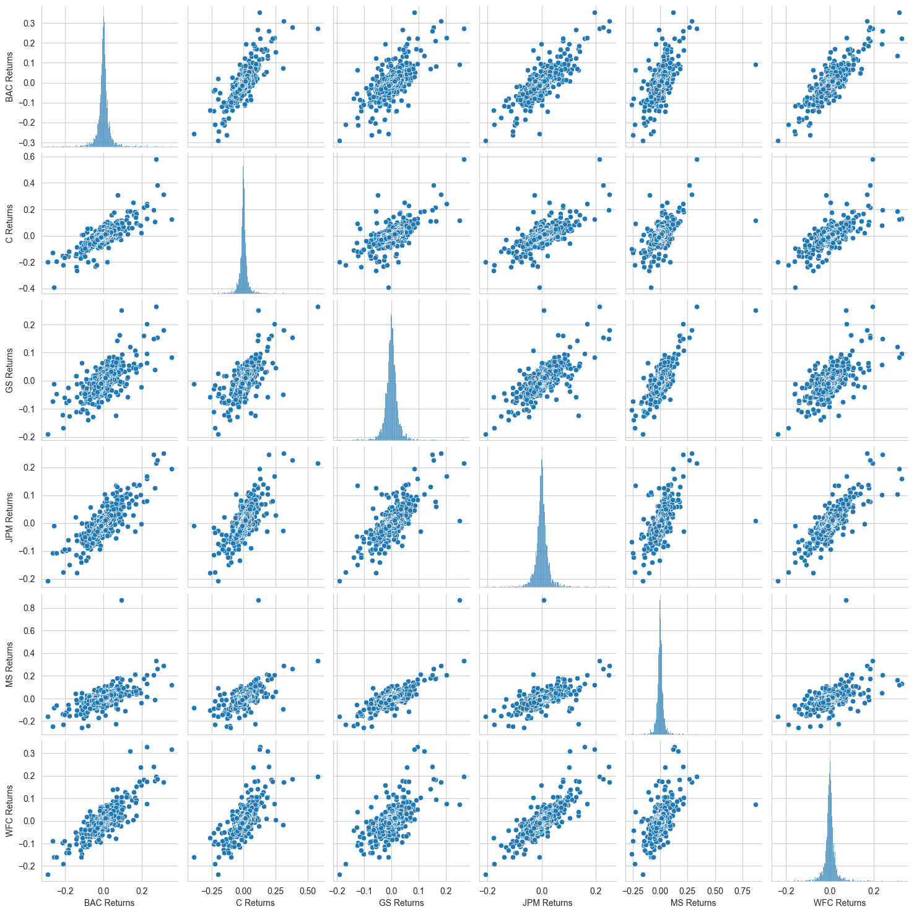
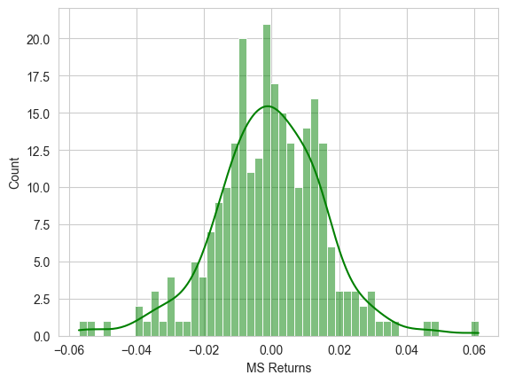
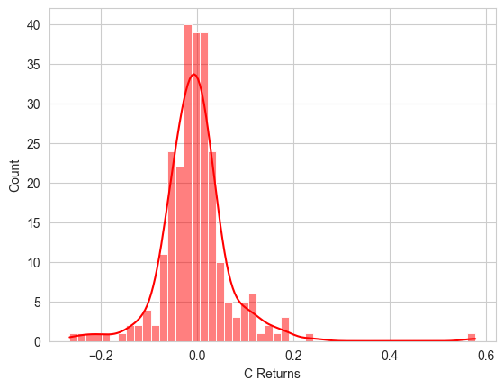
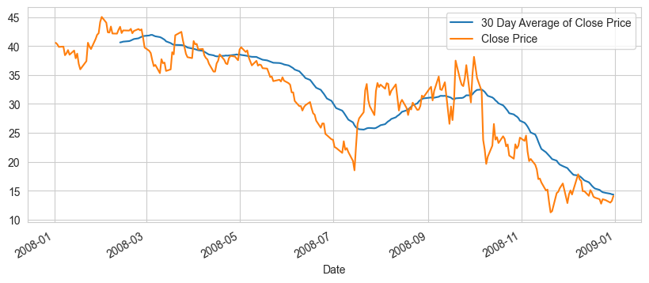
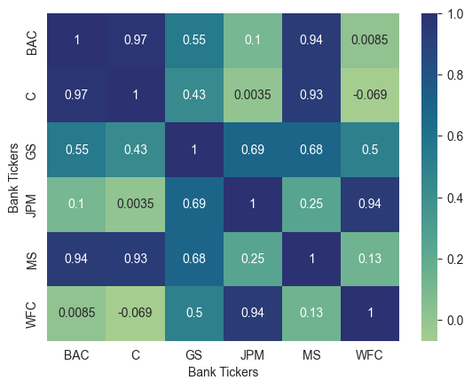
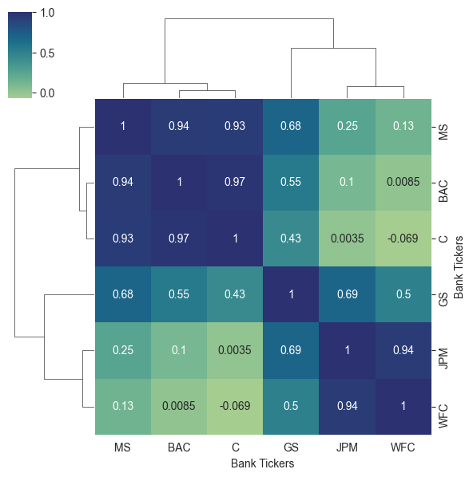
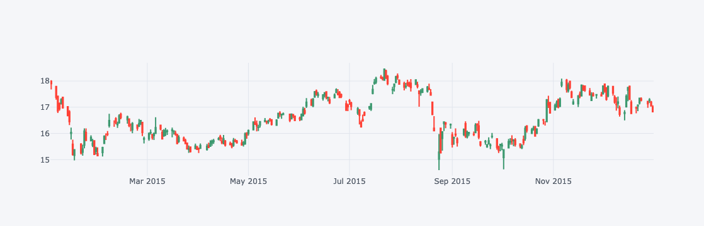
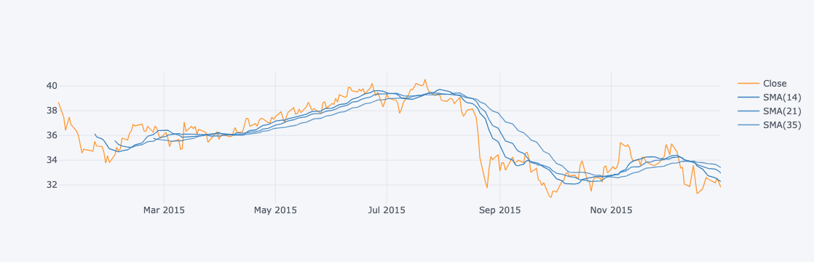
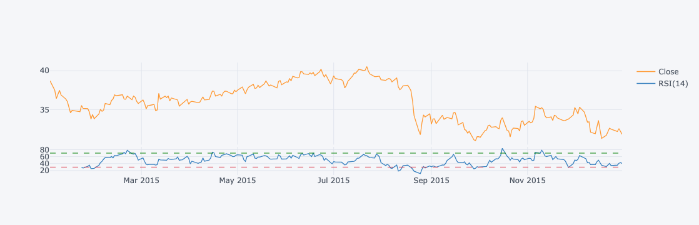
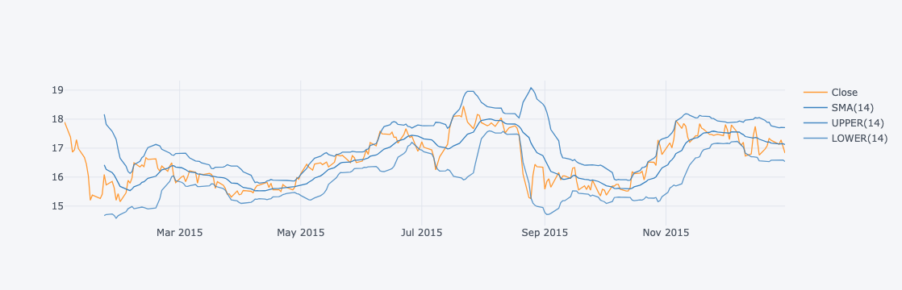

# Stock Analysis

In this project we will focus in exploratory data analysis of stock prices.Keep in mind, this project is just meant to practice visualizations and pandas skills, it is not meant to be a robust financial analysis or be taken as financial advice.


We will focus on some US bank stocks and see how they progressed thoughtout the financial crisis of 2016. Then do a quick comparison with last 10 years data.

### Import your important libraries:


```python
import numpy as np
import pandas as pd 
import matplotlib.pyplot as plt
import seaborn as sns
%matplotlib inline
import datetime as dt
import yfinance as yf


```

#### Import plotly and cufflinks for  interactive graphs
#### cufflinks connects pandas dataframe  with plotly library and helps to run the visualizations directly


```python
!pip install plotly
!pip install cufflinks
```


```python

import plotly 
import cufflinks as cf
cf.go_offline()
```


```python
sns.set_style('whitegrid')
```


## Data

We need to get data using yahoo finance.We will get stock information for the following banks:

- Bank of America
- CitiGroup
- GoldmanSachs
- JPMorgan Chase
- Morgan Stanley
- Wells Fargo

Pull th stock data from Jan 1st 2006 to Jan 1st 2016 for each of these banks. Set each bank to be a separate dataframe, with variable name for that bank being its ticker symbol. This will involve few steps:**

1. Use datetime to set start and end datetime objects.
2. Figure out ticker symbol for each bank.
3. Figure out how to use yfinance to grab info on the stock


```python
start = dt.date(year = 2006, month = 1 , day = 1)
end = dt.date(2016,1,1)
```


```python
#pull the stock information from yfinanc
#Process: create a df(BAC)->pull data using yf library

BAC = yf.download('BAC', start, end)          #Bank of America
C = yf.download('C', start, end)              #Citigroup
GS = yf.download('GS', start, end)            #Goldmansachs
JPM = yf.download('JPM', start, end)          #JPMorgan Chase
MS = yf.download('MS', start, end)            #MorganStanley
WFC = yf.download('WFC', start, end)          #WellsFargo
```

    [*********************100%***********************]  1 of 1 completed
    [*********************100%***********************]  1 of 1 completed
    [*********************100%***********************]  1 of 1 completed
    [*********************100%***********************]  1 of 1 completed
    [*********************100%***********************]  1 of 1 completed
    [*********************100%***********************]  1 of 1 completed


```python
WFC
```


<div>


<table border="1" class="dataframe">
  <thead>
    <tr style="text-align: right;">
      <th></th>
      <th>Open</th>
      <th>High</th>
      <th>Low</th>
      <th>Close</th>
      <th>Adj Close</th>
      <th>Volume</th>
    </tr>
    <tr>
      <th>Date</th>
      <th></th>
      <th></th>
      <th></th>
      <th></th>
      <th></th>
      <th></th>
    </tr>
  </thead>
  <tbody>
    <tr>
      <th>2006-01-03</th>
      <td>31.600000</td>
      <td>31.975000</td>
      <td>31.195000</td>
      <td>31.900000</td>
      <td>18.979551</td>
      <td>11016400</td>
    </tr>
    <tr>
      <th>2006-01-04</th>
      <td>31.799999</td>
      <td>31.820000</td>
      <td>31.365000</td>
      <td>31.530001</td>
      <td>18.759415</td>
      <td>10870000</td>
    </tr>
    <tr>
      <th>2006-01-05</th>
      <td>31.500000</td>
      <td>31.555000</td>
      <td>31.309999</td>
      <td>31.495001</td>
      <td>18.738600</td>
      <td>10158000</td>
    </tr>
    <tr>
      <th>2006-01-06</th>
      <td>31.580000</td>
      <td>31.775000</td>
      <td>31.385000</td>
      <td>31.680000</td>
      <td>18.848658</td>
      <td>8403800</td>
    </tr>
    <tr>
      <th>2006-01-09</th>
      <td>31.674999</td>
      <td>31.825001</td>
      <td>31.555000</td>
      <td>31.674999</td>
      <td>18.845688</td>
      <td>5619600</td>
    </tr>
    <tr>
      <th>...</th>
      <td>...</td>
      <td>...</td>
      <td>...</td>
      <td>...</td>
      <td>...</td>
      <td>...</td>
    </tr>
    <tr>
      <th>2015-12-24</th>
      <td>54.970001</td>
      <td>55.090000</td>
      <td>54.709999</td>
      <td>54.820000</td>
      <td>42.477665</td>
      <td>4999400</td>
    </tr>
    <tr>
      <th>2015-12-28</th>
      <td>54.549999</td>
      <td>54.779999</td>
      <td>54.169998</td>
      <td>54.680000</td>
      <td>42.369175</td>
      <td>8288800</td>
    </tr>
    <tr>
      <th>2015-12-29</th>
      <td>55.110001</td>
      <td>55.349998</td>
      <td>54.990002</td>
      <td>55.290001</td>
      <td>42.841831</td>
      <td>7894900</td>
    </tr>
    <tr>
      <th>2015-12-30</th>
      <td>55.270000</td>
      <td>55.310001</td>
      <td>54.790001</td>
      <td>54.889999</td>
      <td>42.531898</td>
      <td>8016900</td>
    </tr>
    <tr>
      <th>2015-12-31</th>
      <td>54.509998</td>
      <td>54.950001</td>
      <td>54.220001</td>
      <td>54.360001</td>
      <td>42.121220</td>
      <td>10929800</td>
    </tr>
  </tbody>
</table>
<p>2517 rows × 6 columns</p>
</div>


#### Create a list of ticker symbols(as strings) in alphabetical order. Call this list: tickers.


```python
tickers = 'BAC C GS JPM MS WFC'.split()
tickers
```


    ['BAC', 'C', 'GS', 'JPM', 'MS', 'WFC']


#### Use pd.concat to concatenate the bank dataframes together to a single dataframe called bank_stocks. Set the key argument equal to the tickers list.


```python
bank_stocks = pd.concat([BAC, C, GS, JPM, MS, WFC], axis = 1,keys=tickers)
bank_stocks
```


<div>

<table border="1" class="dataframe">
  <thead>
    <tr>
      <th></th>
      <th colspan="6" halign="left">BAC</th>
      <th colspan="4" halign="left">C</th>
      <th>...</th>
      <th colspan="4" halign="left">MS</th>
      <th colspan="6" halign="left">WFC</th>
    </tr>
    <tr>
      <th></th>
      <th>Open</th>
      <th>High</th>
      <th>Low</th>
      <th>Close</th>
      <th>Adj Close</th>
      <th>Volume</th>
      <th>Open</th>
      <th>High</th>
      <th>Low</th>
      <th>Close</th>
      <th>...</th>
      <th>Low</th>
      <th>Close</th>
      <th>Adj Close</th>
      <th>Volume</th>
      <th>Open</th>
      <th>High</th>
      <th>Low</th>
      <th>Close</th>
      <th>Adj Close</th>
      <th>Volume</th>
    </tr>
    <tr>
      <th>Date</th>
      <th></th>
      <th></th>
      <th></th>
      <th></th>
      <th></th>
      <th></th>
      <th></th>
      <th></th>
      <th></th>
      <th></th>
      <th></th>
      <th></th>
      <th></th>
      <th></th>
      <th></th>
      <th></th>
      <th></th>
      <th></th>
      <th></th>
      <th></th>
      <th></th>
    </tr>
  </thead>
  <tbody>
    <tr>
      <th>2006-01-03</th>
      <td>46.919998</td>
      <td>47.180000</td>
      <td>46.150002</td>
      <td>47.080002</td>
      <td>31.544905</td>
      <td>16296700</td>
      <td>490.000000</td>
      <td>493.799988</td>
      <td>481.100006</td>
      <td>492.899994</td>
      <td>...</td>
      <td>56.740002</td>
      <td>58.310001</td>
      <td>32.661312</td>
      <td>5377000</td>
      <td>31.600000</td>
      <td>31.975000</td>
      <td>31.195000</td>
      <td>31.900000</td>
      <td>18.979551</td>
      <td>11016400</td>
    </tr>
    <tr>
      <th>2006-01-04</th>
      <td>47.000000</td>
      <td>47.240002</td>
      <td>46.450001</td>
      <td>46.580002</td>
      <td>31.209898</td>
      <td>17757900</td>
      <td>488.600006</td>
      <td>491.000000</td>
      <td>483.500000</td>
      <td>483.799988</td>
      <td>...</td>
      <td>58.349998</td>
      <td>58.349998</td>
      <td>32.683727</td>
      <td>7977800</td>
      <td>31.799999</td>
      <td>31.820000</td>
      <td>31.365000</td>
      <td>31.530001</td>
      <td>18.759415</td>
      <td>10870000</td>
    </tr>
    <tr>
      <th>2006-01-05</th>
      <td>46.580002</td>
      <td>46.830002</td>
      <td>46.320000</td>
      <td>46.639999</td>
      <td>31.250097</td>
      <td>14970700</td>
      <td>484.399994</td>
      <td>487.799988</td>
      <td>484.000000</td>
      <td>486.200012</td>
      <td>...</td>
      <td>58.020000</td>
      <td>58.509998</td>
      <td>32.773338</td>
      <td>5778000</td>
      <td>31.500000</td>
      <td>31.555000</td>
      <td>31.309999</td>
      <td>31.495001</td>
      <td>18.738600</td>
      <td>10158000</td>
    </tr>
    <tr>
      <th>2006-01-06</th>
      <td>46.799999</td>
      <td>46.910000</td>
      <td>46.349998</td>
      <td>46.570000</td>
      <td>31.203197</td>
      <td>12599800</td>
      <td>488.799988</td>
      <td>489.000000</td>
      <td>482.000000</td>
      <td>486.200012</td>
      <td>...</td>
      <td>58.049999</td>
      <td>58.570000</td>
      <td>32.806950</td>
      <td>6889800</td>
      <td>31.580000</td>
      <td>31.775000</td>
      <td>31.385000</td>
      <td>31.680000</td>
      <td>18.848658</td>
      <td>8403800</td>
    </tr>
    <tr>
      <th>2006-01-09</th>
      <td>46.720001</td>
      <td>46.970001</td>
      <td>46.360001</td>
      <td>46.599998</td>
      <td>31.223280</td>
      <td>15619400</td>
      <td>486.000000</td>
      <td>487.399994</td>
      <td>483.000000</td>
      <td>483.899994</td>
      <td>...</td>
      <td>58.619999</td>
      <td>59.189999</td>
      <td>33.154228</td>
      <td>4144500</td>
      <td>31.674999</td>
      <td>31.825001</td>
      <td>31.555000</td>
      <td>31.674999</td>
      <td>18.845688</td>
      <td>5619600</td>
    </tr>
    <tr>
      <th>...</th>
      <td>...</td>
      <td>...</td>
      <td>...</td>
      <td>...</td>
      <td>...</td>
      <td>...</td>
      <td>...</td>
      <td>...</td>
      <td>...</td>
      <td>...</td>
      <td>...</td>
      <td>...</td>
      <td>...</td>
      <td>...</td>
      <td>...</td>
      <td>...</td>
      <td>...</td>
      <td>...</td>
      <td>...</td>
      <td>...</td>
      <td>...</td>
    </tr>
    <tr>
      <th>2015-12-24</th>
      <td>17.320000</td>
      <td>17.379999</td>
      <td>17.219999</td>
      <td>17.270000</td>
      <td>14.271372</td>
      <td>29369400</td>
      <td>52.480000</td>
      <td>52.970001</td>
      <td>52.450001</td>
      <td>52.709999</td>
      <td>...</td>
      <td>32.439999</td>
      <td>32.480000</td>
      <td>25.353054</td>
      <td>2798200</td>
      <td>54.970001</td>
      <td>55.090000</td>
      <td>54.709999</td>
      <td>54.820000</td>
      <td>42.477665</td>
      <td>4999400</td>
    </tr>
    <tr>
      <th>2015-12-28</th>
      <td>17.219999</td>
      <td>17.230000</td>
      <td>16.980000</td>
      <td>17.129999</td>
      <td>14.155680</td>
      <td>41777500</td>
      <td>52.570000</td>
      <td>52.570000</td>
      <td>51.959999</td>
      <td>52.380001</td>
      <td>...</td>
      <td>31.950001</td>
      <td>32.169998</td>
      <td>25.111073</td>
      <td>5420300</td>
      <td>54.549999</td>
      <td>54.779999</td>
      <td>54.169998</td>
      <td>54.680000</td>
      <td>42.369175</td>
      <td>8288800</td>
    </tr>
    <tr>
      <th>2015-12-29</th>
      <td>17.250000</td>
      <td>17.350000</td>
      <td>17.160000</td>
      <td>17.280001</td>
      <td>14.279634</td>
      <td>45670400</td>
      <td>52.759998</td>
      <td>53.220001</td>
      <td>52.740002</td>
      <td>52.980000</td>
      <td>...</td>
      <td>32.330002</td>
      <td>32.549999</td>
      <td>25.407690</td>
      <td>6388200</td>
      <td>55.110001</td>
      <td>55.349998</td>
      <td>54.990002</td>
      <td>55.290001</td>
      <td>42.841831</td>
      <td>7894900</td>
    </tr>
    <tr>
      <th>2015-12-30</th>
      <td>17.200001</td>
      <td>17.240000</td>
      <td>17.040001</td>
      <td>17.049999</td>
      <td>14.089570</td>
      <td>35066400</td>
      <td>52.840000</td>
      <td>52.939999</td>
      <td>52.250000</td>
      <td>52.299999</td>
      <td>...</td>
      <td>32.200001</td>
      <td>32.230000</td>
      <td>25.157906</td>
      <td>5057200</td>
      <td>55.270000</td>
      <td>55.310001</td>
      <td>54.790001</td>
      <td>54.889999</td>
      <td>42.531898</td>
      <td>8016900</td>
    </tr>
    <tr>
      <th>2015-12-31</th>
      <td>17.010000</td>
      <td>17.070000</td>
      <td>16.830000</td>
      <td>16.830000</td>
      <td>13.907768</td>
      <td>47153000</td>
      <td>52.070000</td>
      <td>52.389999</td>
      <td>51.750000</td>
      <td>51.750000</td>
      <td>...</td>
      <td>31.770000</td>
      <td>31.809999</td>
      <td>24.830067</td>
      <td>8154300</td>
      <td>54.509998</td>
      <td>54.950001</td>
      <td>54.220001</td>
      <td>54.360001</td>
      <td>42.121220</td>
      <td>10929800</td>
    </tr>
  </tbody>
</table>
<p>2517 rows × 36 columns</p>
</div>


### Set the column name levels 'Bank Tickers' and 'Stock info':


```python
bank_stocks.columns.names =['Bank Tickers', 'Stock Info']
bank_stocks.columns.names
```


    FrozenList(['Bank Tickers', 'Stock Info'])


#### Check the head of the bank_stocks dataframe


```python
bank_stocks.head()
```


<div>

<table border="1" class="dataframe">
  <thead>
    <tr>
      <th>Bank Tickers</th>
      <th colspan="6" halign="left">BAC</th>
      <th colspan="4" halign="left">C</th>
      <th>...</th>
      <th colspan="4" halign="left">MS</th>
      <th colspan="6" halign="left">WFC</th>
    </tr>
    <tr>
      <th>Stock Info</th>
      <th>Open</th>
      <th>High</th>
      <th>Low</th>
      <th>Close</th>
      <th>Adj Close</th>
      <th>Volume</th>
      <th>Open</th>
      <th>High</th>
      <th>Low</th>
      <th>Close</th>
      <th>...</th>
      <th>Low</th>
      <th>Close</th>
      <th>Adj Close</th>
      <th>Volume</th>
      <th>Open</th>
      <th>High</th>
      <th>Low</th>
      <th>Close</th>
      <th>Adj Close</th>
      <th>Volume</th>
    </tr>
    <tr>
      <th>Date</th>
      <th></th>
      <th></th>
      <th></th>
      <th></th>
      <th></th>
      <th></th>
      <th></th>
      <th></th>
      <th></th>
      <th></th>
      <th></th>
      <th></th>
      <th></th>
      <th></th>
      <th></th>
      <th></th>
      <th></th>
      <th></th>
      <th></th>
      <th></th>
      <th></th>
    </tr>
  </thead>
  <tbody>
    <tr>
      <th>2006-01-03</th>
      <td>46.919998</td>
      <td>47.180000</td>
      <td>46.150002</td>
      <td>47.080002</td>
      <td>31.544905</td>
      <td>16296700</td>
      <td>490.000000</td>
      <td>493.799988</td>
      <td>481.100006</td>
      <td>492.899994</td>
      <td>...</td>
      <td>56.740002</td>
      <td>58.310001</td>
      <td>32.661312</td>
      <td>5377000</td>
      <td>31.600000</td>
      <td>31.975000</td>
      <td>31.195000</td>
      <td>31.900000</td>
      <td>18.979551</td>
      <td>11016400</td>
    </tr>
    <tr>
      <th>2006-01-04</th>
      <td>47.000000</td>
      <td>47.240002</td>
      <td>46.450001</td>
      <td>46.580002</td>
      <td>31.209898</td>
      <td>17757900</td>
      <td>488.600006</td>
      <td>491.000000</td>
      <td>483.500000</td>
      <td>483.799988</td>
      <td>...</td>
      <td>58.349998</td>
      <td>58.349998</td>
      <td>32.683727</td>
      <td>7977800</td>
      <td>31.799999</td>
      <td>31.820000</td>
      <td>31.365000</td>
      <td>31.530001</td>
      <td>18.759415</td>
      <td>10870000</td>
    </tr>
    <tr>
      <th>2006-01-05</th>
      <td>46.580002</td>
      <td>46.830002</td>
      <td>46.320000</td>
      <td>46.639999</td>
      <td>31.250097</td>
      <td>14970700</td>
      <td>484.399994</td>
      <td>487.799988</td>
      <td>484.000000</td>
      <td>486.200012</td>
      <td>...</td>
      <td>58.020000</td>
      <td>58.509998</td>
      <td>32.773338</td>
      <td>5778000</td>
      <td>31.500000</td>
      <td>31.555000</td>
      <td>31.309999</td>
      <td>31.495001</td>
      <td>18.738600</td>
      <td>10158000</td>
    </tr>
    <tr>
      <th>2006-01-06</th>
      <td>46.799999</td>
      <td>46.910000</td>
      <td>46.349998</td>
      <td>46.570000</td>
      <td>31.203197</td>
      <td>12599800</td>
      <td>488.799988</td>
      <td>489.000000</td>
      <td>482.000000</td>
      <td>486.200012</td>
      <td>...</td>
      <td>58.049999</td>
      <td>58.570000</td>
      <td>32.806950</td>
      <td>6889800</td>
      <td>31.580000</td>
      <td>31.775000</td>
      <td>31.385000</td>
      <td>31.680000</td>
      <td>18.848658</td>
      <td>8403800</td>
    </tr>
    <tr>
      <th>2006-01-09</th>
      <td>46.720001</td>
      <td>46.970001</td>
      <td>46.360001</td>
      <td>46.599998</td>
      <td>31.223280</td>
      <td>15619400</td>
      <td>486.000000</td>
      <td>487.399994</td>
      <td>483.000000</td>
      <td>483.899994</td>
      <td>...</td>
      <td>58.619999</td>
      <td>59.189999</td>
      <td>33.154228</td>
      <td>4144500</td>
      <td>31.674999</td>
      <td>31.825001</td>
      <td>31.555000</td>
      <td>31.674999</td>
      <td>18.845688</td>
      <td>5619600</td>
    </tr>
  </tbody>
</table>
<p>5 rows × 36 columns</p>
</div>


## Exploratory Data Analysis

#### _Let's explore the data a bit! What is the max Close price for each bank's stock throughout the time period_


```python
# use cross section for multiindex data frames

bank_stocks.xs('Close',axis=1,level=1) # Returns the dataframe with Close columns

```


<div>


<table border="1" class="dataframe">
  <thead>
    <tr style="text-align: right;">
      <th>Bank Tickers</th>
      <th>BAC</th>
      <th>C</th>
      <th>GS</th>
      <th>JPM</th>
      <th>MS</th>
      <th>WFC</th>
    </tr>
    <tr>
      <th>Date</th>
      <th></th>
      <th></th>
      <th></th>
      <th></th>
      <th></th>
      <th></th>
    </tr>
  </thead>
  <tbody>
    <tr>
      <th>2006-01-03</th>
      <td>47.080002</td>
      <td>492.899994</td>
      <td>128.869995</td>
      <td>40.189999</td>
      <td>58.310001</td>
      <td>31.900000</td>
    </tr>
    <tr>
      <th>2006-01-04</th>
      <td>46.580002</td>
      <td>483.799988</td>
      <td>127.089996</td>
      <td>39.619999</td>
      <td>58.349998</td>
      <td>31.530001</td>
    </tr>
    <tr>
      <th>2006-01-05</th>
      <td>46.639999</td>
      <td>486.200012</td>
      <td>127.040001</td>
      <td>39.740002</td>
      <td>58.509998</td>
      <td>31.495001</td>
    </tr>
    <tr>
      <th>2006-01-06</th>
      <td>46.570000</td>
      <td>486.200012</td>
      <td>128.839996</td>
      <td>40.020000</td>
      <td>58.570000</td>
      <td>31.680000</td>
    </tr>
    <tr>
      <th>2006-01-09</th>
      <td>46.599998</td>
      <td>483.899994</td>
      <td>130.389999</td>
      <td>40.669998</td>
      <td>59.189999</td>
      <td>31.674999</td>
    </tr>
    <tr>
      <th>...</th>
      <td>...</td>
      <td>...</td>
      <td>...</td>
      <td>...</td>
      <td>...</td>
      <td>...</td>
    </tr>
    <tr>
      <th>2015-12-24</th>
      <td>17.270000</td>
      <td>52.709999</td>
      <td>182.470001</td>
      <td>66.599998</td>
      <td>32.480000</td>
      <td>54.820000</td>
    </tr>
    <tr>
      <th>2015-12-28</th>
      <td>17.129999</td>
      <td>52.380001</td>
      <td>181.619995</td>
      <td>66.379997</td>
      <td>32.169998</td>
      <td>54.680000</td>
    </tr>
    <tr>
      <th>2015-12-29</th>
      <td>17.280001</td>
      <td>52.980000</td>
      <td>183.529999</td>
      <td>67.070000</td>
      <td>32.549999</td>
      <td>55.290001</td>
    </tr>
    <tr>
      <th>2015-12-30</th>
      <td>17.049999</td>
      <td>52.299999</td>
      <td>182.009995</td>
      <td>66.589996</td>
      <td>32.230000</td>
      <td>54.889999</td>
    </tr>
    <tr>
      <th>2015-12-31</th>
      <td>16.830000</td>
      <td>51.750000</td>
      <td>180.229996</td>
      <td>66.029999</td>
      <td>31.809999</td>
      <td>54.360001</td>
    </tr>
  </tbody>
</table>
<p>2517 rows × 6 columns</p>
</div>


```python
bank_stocks.xs('Close',axis=1,level=1).max() #Returns the max value of each column
```


    Bank Tickers
    BAC     54.900002
    C      564.099976
    GS     247.919998
    JPM     70.080002
    MS      89.300003
    WFC     58.520000
    dtype: float64


#### Create a new empty DataFrame called returns. The dataframe will contain the returns for each bank's stock. returns are typically defined by 
$$
r_t = \frac{P_t - P_{t-1}}{ P_t-1} = \frac{P_t}{P_{t-1}}-1 
$$


```python
returns = pd.DataFrame()
print(returns)
```

    Empty DataFrame
    Columns: []
    Index: []


#### Use pandas pct_change() method on the Close column to create a column representing this return value. Create a for loop that goes and for each Bank Stock Ticker creates this returns column and sets it as a column in the returns DataFrame.


```python
for i in tickers: 
    returns[i + ' Returns'] = bank_stocks.xs('Close', axis = 1, level = 1)[i].pct_change() 
    
```


```python
returns

```


<div>

<table border="1" class="dataframe">
  <thead>
    <tr style="text-align: right;">
      <th></th>
      <th>BAC Returns</th>
      <th>C Returns</th>
      <th>GS Returns</th>
      <th>JPM Returns</th>
      <th>MS Returns</th>
      <th>WFC Returns</th>
    </tr>
    <tr>
      <th>Date</th>
      <th></th>
      <th></th>
      <th></th>
      <th></th>
      <th></th>
      <th></th>
    </tr>
  </thead>
  <tbody>
    <tr>
      <th>2006-01-03</th>
      <td>NaN</td>
      <td>NaN</td>
      <td>NaN</td>
      <td>NaN</td>
      <td>NaN</td>
      <td>NaN</td>
    </tr>
    <tr>
      <th>2006-01-04</th>
      <td>-0.010620</td>
      <td>-0.018462</td>
      <td>-0.013812</td>
      <td>-0.014183</td>
      <td>0.000686</td>
      <td>-0.011599</td>
    </tr>
    <tr>
      <th>2006-01-05</th>
      <td>0.001288</td>
      <td>0.004961</td>
      <td>-0.000393</td>
      <td>0.003029</td>
      <td>0.002742</td>
      <td>-0.001110</td>
    </tr>
    <tr>
      <th>2006-01-06</th>
      <td>-0.001501</td>
      <td>0.000000</td>
      <td>0.014169</td>
      <td>0.007046</td>
      <td>0.001025</td>
      <td>0.005874</td>
    </tr>
    <tr>
      <th>2006-01-09</th>
      <td>0.000644</td>
      <td>-0.004731</td>
      <td>0.012030</td>
      <td>0.016242</td>
      <td>0.010586</td>
      <td>-0.000158</td>
    </tr>
    <tr>
      <th>...</th>
      <td>...</td>
      <td>...</td>
      <td>...</td>
      <td>...</td>
      <td>...</td>
      <td>...</td>
    </tr>
    <tr>
      <th>2015-12-24</th>
      <td>-0.004037</td>
      <td>0.001520</td>
      <td>-0.002624</td>
      <td>-0.001948</td>
      <td>-0.003681</td>
      <td>-0.003997</td>
    </tr>
    <tr>
      <th>2015-12-28</th>
      <td>-0.008107</td>
      <td>-0.006261</td>
      <td>-0.004658</td>
      <td>-0.003303</td>
      <td>-0.009544</td>
      <td>-0.002554</td>
    </tr>
    <tr>
      <th>2015-12-29</th>
      <td>0.008757</td>
      <td>0.011455</td>
      <td>0.010516</td>
      <td>0.010395</td>
      <td>0.011812</td>
      <td>0.011156</td>
    </tr>
    <tr>
      <th>2015-12-30</th>
      <td>-0.013310</td>
      <td>-0.012835</td>
      <td>-0.008282</td>
      <td>-0.007157</td>
      <td>-0.009831</td>
      <td>-0.007235</td>
    </tr>
    <tr>
      <th>2015-12-31</th>
      <td>-0.012903</td>
      <td>-0.010516</td>
      <td>-0.009780</td>
      <td>-0.008410</td>
      <td>-0.013031</td>
      <td>-0.009656</td>
    </tr>
  </tbody>
</table>
<p>2517 rows × 6 columns</p>
</div>


**Observations**

- _What pct_change() does here is it computes the fractional change from the immidiately previous row by default. It is useful for comparing the fraction of change in a time series of elements. Remeber here it is a fraction if yoou want to change it to percentage u want to multiply it with 100_
- _So we have got the columns for each of the stock tickers for each trading day_
- _For the first day the return is obiviously **Nan** as there was no prior day element to calculate it_
- _From the second row we can see the positive and negative returns , negatives are the days where it went down and positives are the days when it went up_

#### Create a pair plot using seaborn of the returns dataframe. Do any stocks stands out ? Why or why not?


```python
sns.pairplot(returns)
```


    <seaborn.axisgrid.PairGrid at 0x3392183a0>


    

    


**Observations**
- _Diagonal elements are univariant data i.e, just for that particular column_
- _Off diagonal elements are bivariant data_
- _What pairplot does here is it creates a group of scatter plots for each pair of the numerical data in the data frame,For exit will create a 'BAC' vs 'C' scatterplot, 'BAC' vs 'GS' scatter plot and so on._
- _So we have all of these tickers/banks on X-axis and the same banks as well as on the Y-axis_.
- _So if you compare 'WFC Returns' to the 'WFC Returns' it is a univariant data so therefore we have a Histogram._
- _If you compare 'WFC Returns' to the other banks we have the scatter plots to analyse the data._
- _Its very important to check the scales for it , almost everything are in decimals on both X and Y axis._
- _Sometimes based on the data you can get different scales for one of the columns and that graph will look very different._
- _Lets look at the 'MS Returns' graph is going from -0.25 to 0.75 and there is only one outlier point that is there at 0.75 which makes the slope is much higher but if you ignore the outlier the slope will be much equal as the distance from zero on both sides is almost equal for rest of the datapoints._ 
- _Same with the 'Citi Group' except few(countable) points most of them lies in the range of -0.25 to 0.25._
- _So if you analyse this for 'BAC Returns' compared to other banks, there is a very strong correlation between these banks or the returns of these banks as the X-axis goes up Y-axis goes up as well and that pattern is prevalent for all combinations of the all pairs of the banks here._


```python
returns.corr()
```

<div>

<table border="1" class="dataframe">
  <thead>
    <tr style="text-align: right;">
      <th></th>
      <th>BAC Returns</th>
      <th>C Returns</th>
      <th>GS Returns</th>
      <th>JPM Returns</th>
      <th>MS Returns</th>
      <th>WFC Returns</th>
    </tr>
  </thead>
  <tbody>
    <tr>
      <th>BAC Returns</th>
      <td>1.000000</td>
      <td>0.802752</td>
      <td>0.685271</td>
      <td>0.815410</td>
      <td>0.643840</td>
      <td>0.828337</td>
    </tr>
    <tr>
      <th>C Returns</th>
      <td>0.802752</td>
      <td>1.000000</td>
      <td>0.668989</td>
      <td>0.739045</td>
      <td>0.634352</td>
      <td>0.717386</td>
    </tr>
    <tr>
      <th>GS Returns</th>
      <td>0.685271</td>
      <td>0.668989</td>
      <td>1.000000</td>
      <td>0.738671</td>
      <td>0.805155</td>
      <td>0.662847</td>
    </tr>
    <tr>
      <th>JPM Returns</th>
      <td>0.815410</td>
      <td>0.739045</td>
      <td>0.738671</td>
      <td>1.000000</td>
      <td>0.646711</td>
      <td>0.826276</td>
    </tr>
    <tr>
      <th>MS Returns</th>
      <td>0.643840</td>
      <td>0.634352</td>
      <td>0.805155</td>
      <td>0.646711</td>
      <td>1.000000</td>
      <td>0.598681</td>
    </tr>
    <tr>
      <th>WFC Returns</th>
      <td>0.828337</td>
      <td>0.717386</td>
      <td>0.662847</td>
      <td>0.826276</td>
      <td>0.598681</td>
      <td>1.000000</td>
    </tr>
  </tbody>
</table>
</div>


**Observations**
- _We can see the correlation in the matrix format._
- _We can use these later to create a heat map._
- _'BAC Returns have strong relationship with the 'City Bank', 'JPMorgan' and 'WellsFargo' compared to the 'GoldmanSachs' and 'Morgan Stanley' banks._

### Using this returns DataFrame, figure out on what dates each bank stock had the best and worst single day returns. Did anything significant happen on those days?


```python
#Best single day returns
returns.max()  #Returns the max value of each column 
```


    BAC Returns    0.352691
    C Returns      0.578249
    GS Returns     0.264678
    JPM Returns    0.250967
    MS Returns     0.869835
    WFC Returns    0.327645
    dtype: float64


```python
#Best single day returns
returns.idxmax() #Returns the index of the max value
```


    BAC Returns   2009-04-09
    C Returns     2008-11-24
    GS Returns    2008-11-24
    JPM Returns   2009-01-21
    MS Returns    2008-10-13
    WFC Returns   2008-07-16
    dtype: datetime64[ns]


```python
#Worst single day returns
returns.idxmin() #Returns the index of the min value
```


    BAC Returns   2009-01-20
    C Returns     2009-02-27
    GS Returns    2009-01-20
    JPM Returns   2009-01-20
    MS Returns    2008-10-09
    WFC Returns   2009-01-20
    dtype: datetime64[ns]


**Did anything significant happen on those days?**

**Best days**
- _If you notice the JPMorgan returns the best performance day(2009-01-21) was exactly after the worst performance day(2009-01-20) and the reason for that was it received a 700 billion dollar bailout from the federal reserve._


**Worst days**
- _If you look carefully four of the banks Bank of America, Goldman Sachs, JPMorgan and Wells Fargo had the worst return on the same day._

   *What happened exactly?*
  
- _On the particular day 2009-01-20, The Icelands banks collapsed._
  
- _InShort, About Iceland banks, During 2000-2007 the Icelandic banks were privatised and saw quiet a bit of Boom years so much so that the country's entire economy and GDP became dependent on the performance of the banks, and when the economy collapsed theirs banks and government collapsed . That might have created a widespread of panic in the market which might be one of the reasons for the decline on the particular day [[ 1 ](https://en.wikipedia.org/wiki/2009_Icelandic_financial_crisis_protests)][[2 . Finacncial crisis 2009](https://en.wikipedia.org/wiki/2007%E2%80%932008_financial_crisis)]._
  


- For the City Bank,On 27th February 2009,The US government has reached a deal to take a stake of 30 to 40 percent , which raised concerns among the Investors regarding the nationalisation of the banks and thats why it has the biggest decline of its stock worldwide on that particular day.

[More Details](https://www.theguardian.com/business/2009/jan/20/stock-market-drop-obama-inauguration)


### Take a look at the standard deviation of the returns, which stock would you classify as the riskiest over the entire period? Which would u classify as the riskiest for the year 2015?


```python
#For the entire 10 years period (More riskier higher the std.deviation)
returns.std()

```


    BAC Returns    0.036647
    C Returns      0.038672
    GS Returns     0.025390
    JPM Returns    0.027667
    MS Returns     0.037819
    WFC Returns    0.030238
    dtype: float64


**Observations**

- _There isnt much to differentiate between these stocks. Statistically, you can say Citi bank is the most riskiest but its only by the bearest of margin really insignificant. Practically they all had similiar risk._


```python
#For year 2015
```


```python
returns.loc['2015-01-01':'2015-12-31'].std()
```


    BAC Returns    0.016163
    C Returns      0.015289
    GS Returns     0.014046
    JPM Returns    0.014017
    MS Returns     0.016249
    WFC Returns    0.012591
    dtype: float64


**Obseravtion** 

- _There isnt much difference among these stocks they all posses similiar risk._

### Create a histplot using seaborn of the 2015 returns for the Morgan Stanley


```python
sns.histplot(returns.loc['2015-01-01':'2015-12-31']['MS Returns'], color ='g', bins =50, kde = True)
```


    <Axes: xlabel='MS Returns', ylabel='Count'>


    

    


**Observations** 
- _If you see the data most of the data is in between -0.02 and 0.02. If you imagine this in percentage by multiplying the numbers with 100,so most of the daily return within plus or  minus 2% of the previous day number._

### Create a histplot using seaborn of the 2008 returns for the CitiGroup


```python
sns.histplot(returns.loc['2008-01-01':'2008-12-31']['C Returns'], color = 'r', bins = 50, kde= True)
```


    <Axes: xlabel='C Returns', ylabel='Count'>


    

    


**Observations**

- _If you notice the Kde graph there is a long tail on the right side that is because of some point 0.6 . Basically it says that they have a day where there is very high return approx. 6 percent but its only few days maybe only one or two days._

### Create a line plot showing Close price for each bank for the entire index of time.


```python
bank_stocks.xs('Close', axis = 1 ,level = 1).iplot(kind = 'line')
```

   
### Moving Averages

Lets analyze the moving average for these stocks in the year 2008


```python
BAC.loc['2008-01-01':'2008-12-31'].rolling(window=30).std().head(30)

```
<div>

<table border="1" class="dataframe">
  <thead>
    <tr style="text-align: right;">
      <th></th>
      <th>Open</th>
      <th>High</th>
      <th>Low</th>
      <th>Close</th>
      <th>Adj Close</th>
      <th>Volume</th>
    </tr>
    <tr>
      <th>Date</th>
      <th></th>
      <th></th>
      <th></th>
      <th></th>
      <th></th>
      <th></th>
    </tr>
  </thead>
  <tbody>
    <tr>
      <th>2008-01-02</th>
      <td>NaN</td>
      <td>NaN</td>
      <td>NaN</td>
      <td>NaN</td>
      <td>NaN</td>
      <td>NaN</td>
    </tr>
    <tr>
      <th>2008-01-03</th>
      <td>NaN</td>
      <td>NaN</td>
      <td>NaN</td>
      <td>NaN</td>
      <td>NaN</td>
      <td>NaN</td>
    </tr>
    <tr>
      <th>2008-01-04</th>
      <td>NaN</td>
      <td>NaN</td>
      <td>NaN</td>
      <td>NaN</td>
      <td>NaN</td>
      <td>NaN</td>
    </tr>
    <tr>
      <th>2008-01-07</th>
      <td>NaN</td>
      <td>NaN</td>
      <td>NaN</td>
      <td>NaN</td>
      <td>NaN</td>
      <td>NaN</td>
    </tr>
    <tr>
      <th>2008-01-08</th>
      <td>NaN</td>
      <td>NaN</td>
      <td>NaN</td>
      <td>NaN</td>
      <td>NaN</td>
      <td>NaN</td>
    </tr>
    <tr>
      <th>2008-01-09</th>
      <td>NaN</td>
      <td>NaN</td>
      <td>NaN</td>
      <td>NaN</td>
      <td>NaN</td>
      <td>NaN</td>
    </tr>
    <tr>
      <th>2008-01-10</th>
      <td>NaN</td>
      <td>NaN</td>
      <td>NaN</td>
      <td>NaN</td>
      <td>NaN</td>
      <td>NaN</td>
    </tr>
    <tr>
      <th>2008-01-11</th>
      <td>NaN</td>
      <td>NaN</td>
      <td>NaN</td>
      <td>NaN</td>
      <td>NaN</td>
      <td>NaN</td>
    </tr>
    <tr>
      <th>2008-01-14</th>
      <td>NaN</td>
      <td>NaN</td>
      <td>NaN</td>
      <td>NaN</td>
      <td>NaN</td>
      <td>NaN</td>
    </tr>
    <tr>
      <th>2008-01-15</th>
      <td>NaN</td>
      <td>NaN</td>
      <td>NaN</td>
      <td>NaN</td>
      <td>NaN</td>
      <td>NaN</td>
    </tr>
    <tr>
      <th>2008-01-16</th>
      <td>NaN</td>
      <td>NaN</td>
      <td>NaN</td>
      <td>NaN</td>
      <td>NaN</td>
      <td>NaN</td>
    </tr>
    <tr>
      <th>2008-01-17</th>
      <td>NaN</td>
      <td>NaN</td>
      <td>NaN</td>
      <td>NaN</td>
      <td>NaN</td>
      <td>NaN</td>
    </tr>
    <tr>
      <th>2008-01-18</th>
      <td>NaN</td>
      <td>NaN</td>
      <td>NaN</td>
      <td>NaN</td>
      <td>NaN</td>
      <td>NaN</td>
    </tr>
    <tr>
      <th>2008-01-22</th>
      <td>NaN</td>
      <td>NaN</td>
      <td>NaN</td>
      <td>NaN</td>
      <td>NaN</td>
      <td>NaN</td>
    </tr>
    <tr>
      <th>2008-01-23</th>
      <td>NaN</td>
      <td>NaN</td>
      <td>NaN</td>
      <td>NaN</td>
      <td>NaN</td>
      <td>NaN</td>
    </tr>
    <tr>
      <th>2008-01-24</th>
      <td>NaN</td>
      <td>NaN</td>
      <td>NaN</td>
      <td>NaN</td>
      <td>NaN</td>
      <td>NaN</td>
    </tr>
    <tr>
      <th>2008-01-25</th>
      <td>NaN</td>
      <td>NaN</td>
      <td>NaN</td>
      <td>NaN</td>
      <td>NaN</td>
      <td>NaN</td>
    </tr>
    <tr>
      <th>2008-01-28</th>
      <td>NaN</td>
      <td>NaN</td>
      <td>NaN</td>
      <td>NaN</td>
      <td>NaN</td>
      <td>NaN</td>
    </tr>
    <tr>
      <th>2008-01-29</th>
      <td>NaN</td>
      <td>NaN</td>
      <td>NaN</td>
      <td>NaN</td>
      <td>NaN</td>
      <td>NaN</td>
    </tr>
    <tr>
      <th>2008-01-30</th>
      <td>NaN</td>
      <td>NaN</td>
      <td>NaN</td>
      <td>NaN</td>
      <td>NaN</td>
      <td>NaN</td>
    </tr>
    <tr>
      <th>2008-01-31</th>
      <td>NaN</td>
      <td>NaN</td>
      <td>NaN</td>
      <td>NaN</td>
      <td>NaN</td>
      <td>NaN</td>
    </tr>
    <tr>
      <th>2008-02-01</th>
      <td>NaN</td>
      <td>NaN</td>
      <td>NaN</td>
      <td>NaN</td>
      <td>NaN</td>
      <td>NaN</td>
    </tr>
    <tr>
      <th>2008-02-04</th>
      <td>NaN</td>
      <td>NaN</td>
      <td>NaN</td>
      <td>NaN</td>
      <td>NaN</td>
      <td>NaN</td>
    </tr>
    <tr>
      <th>2008-02-05</th>
      <td>NaN</td>
      <td>NaN</td>
      <td>NaN</td>
      <td>NaN</td>
      <td>NaN</td>
      <td>NaN</td>
    </tr>
    <tr>
      <th>2008-02-06</th>
      <td>NaN</td>
      <td>NaN</td>
      <td>NaN</td>
      <td>NaN</td>
      <td>NaN</td>
      <td>NaN</td>
    </tr>
    <tr>
      <th>2008-02-07</th>
      <td>NaN</td>
      <td>NaN</td>
      <td>NaN</td>
      <td>NaN</td>
      <td>NaN</td>
      <td>NaN</td>
    </tr>
    <tr>
      <th>2008-02-08</th>
      <td>NaN</td>
      <td>NaN</td>
      <td>NaN</td>
      <td>NaN</td>
      <td>NaN</td>
      <td>NaN</td>
    </tr>
    <tr>
      <th>2008-02-11</th>
      <td>NaN</td>
      <td>NaN</td>
      <td>NaN</td>
      <td>NaN</td>
      <td>NaN</td>
      <td>NaN</td>
    </tr>
    <tr>
      <th>2008-02-12</th>
      <td>NaN</td>
      <td>NaN</td>
      <td>NaN</td>
      <td>NaN</td>
      <td>NaN</td>
      <td>NaN</td>
    </tr>
    <tr>
      <th>2008-02-13</th>
      <td>2.490761</td>
      <td>2.092302</td>
      <td>2.555124</td>
      <td>2.313858</td>
      <td>1.698958</td>
      <td>2.104923e+07</td>
    </tr>
  </tbody>
</table>
</div>


### Plot the rolling 30 day average against the Close Price for Bank Of America's stock for the year 2008


```python
BAC.loc['2008-01-01':'2008-12-31']['Close'].rolling(window=30).mean().plot(figsize = (10,4), label = '30 Day Average of Close Price')
BAC.loc['2008-01-01':'2008-12-31']['Close'].plot(label = 'Close Price')
plt.legend()
```


    


**Observations**

- _If you see the difference between rolling average and actual closing stock prices, the real stock prices can have sharp declines and inclines and what the 30 day average does is it ignores those sharp edges and smoothens the data based on average of the last 30 days at each point. This is basically used to analyse the stock data so the sudden falls can be ignored and its not the part of the stock analysis unless it is sustained over a longer period of time._
- _If u see the data between 2008-05 to 2008-07 the stock price started to fall but the average price was still high and because the fall sustained over a period of time the avg value came down as well. The avg values has much more roundish edge and the actual closing price has a sharp edge and the same thing happens between the period 2008-07 to 2008-11 as well._


### Create a heatmap of the correlation between the stocks Close price.


```python
bank_stocks.xs('Close', axis=1, level=1).corr()
```

<div>

<table border="1" class="dataframe">
  <thead>
    <tr style="text-align: right;">
      <th>Bank Tickers</th>
      <th>BAC</th>
      <th>C</th>
      <th>GS</th>
      <th>JPM</th>
      <th>MS</th>
      <th>WFC</th>
    </tr>
    <tr>
      <th>Bank Tickers</th>
      <th></th>
      <th></th>
      <th></th>
      <th></th>
      <th></th>
      <th></th>
    </tr>
  </thead>
  <tbody>
    <tr>
      <th>BAC</th>
      <td>1.000000</td>
      <td>0.971516</td>
      <td>0.550898</td>
      <td>0.103874</td>
      <td>0.944218</td>
      <td>0.008542</td>
    </tr>
    <tr>
      <th>C</th>
      <td>0.971516</td>
      <td>1.000000</td>
      <td>0.434123</td>
      <td>0.003515</td>
      <td>0.933609</td>
      <td>-0.068536</td>
    </tr>
    <tr>
      <th>GS</th>
      <td>0.550898</td>
      <td>0.434123</td>
      <td>1.000000</td>
      <td>0.685286</td>
      <td>0.683792</td>
      <td>0.499897</td>
    </tr>
    <tr>
      <th>JPM</th>
      <td>0.103874</td>
      <td>0.003515</td>
      <td>0.685286</td>
      <td>1.000000</td>
      <td>0.250427</td>
      <td>0.940269</td>
    </tr>
    <tr>
      <th>MS</th>
      <td>0.944218</td>
      <td>0.933609</td>
      <td>0.683792</td>
      <td>0.250427</td>
      <td>1.000000</td>
      <td>0.131835</td>
    </tr>
    <tr>
      <th>WFC</th>
      <td>0.008542</td>
      <td>-0.068536</td>
      <td>0.499897</td>
      <td>0.940269</td>
      <td>0.131835</td>
      <td>1.000000</td>
    </tr>
  </tbody>
</table>
</div>


```python
sns.heatmap(bank_stocks.xs('Close', axis=1, level=1).corr(),cmap = 'crest', annot = True)
```


    



**Observations:** 
- _If you see correlation between bank of america to bank of america is same ._
- _Correlation basically says if the stock price for the bank of america/any bank increases what is the movement of the stock price for the other banks. So it basically denotes the linear relationship between those banks._
-  _+ve relationship means if price of one bank increases, price of the other bank increases as well, -ve relation will show movement on the negative direction compared to the stock_.
-  _Correlation always varies between -1 to 1._
-  _+ve 1 could mean perfect correlation which means both the stock goes up or down at the same time._
-  _-ve 1 means everytime the stock goes up the other stock goes down._
-  _Correlation of zero(0) means that they dont have correlation among themselves. The movement of one stock has no relationship with the movement of the other stock._
-  _These are used by the hedgefunds and other guys who take lot of risk to hedge their risk based on the movement of the stock price. So if the are betting on BAC to go up it has a -ve correlation with some other stock and they can make some position in the other stock as well. So just in case if BAC goes down the other stock might go up there by they might not be losing as much money._
-  _You can clearly see the BAC has a strong correlationship with the City Bank and Morgan Stanley Banks where as a very weak correlationship with WellsFargo. Even with JPMorgan it is 0.1 which is a weak correlation and close to zero ._

#### Use seaborn's clustermap to cluster the correlations together:


```python
sns.clustermap(bank_stocks.xs('Close', axis=1, level=1).corr(),figsize=(6,6),cmap = 'crest',annot= True)
```




**Observations**

- _Basically what clustermap does is that it creates a cluster based on the closed data._
- _If you see on the both X and the Y axis, the map BAC lies between MS and C whereas in the heatmap its had very strong relationship with the City bank and Morgan Stanley and Wells Fargo and JPMorgan were close to eachother.So in the cluster map WFC and JPM has put together._
 

## USING CUFFLINKS

#### Use .plot(kind='candle') to create a candle plot of Bank of americas stock from Jans 1st 2015 to Jan 1st 2016.


```python
BAC.loc['2015-01-01':'2016-01-01'].iplot(kind='candle')

```


#### Use .ta_plot(study='sma') to create a Simple Moving Average plot of Morgan Stanley for the year 2015.


```python
MS.loc['2015-01-01':'2016-01-01']['Close'].ta_plot(study='sma',period=[14,21,55])
```



**Observations**
- _Simple moving average smoothens the edges of the stock._
- _period=[14,21,55] -> This gives the simple moving averages of 14th 21 and 55th day._


```python
MS.loc['2015-01-01':'2016-01-01']['Close'].ta_plot(study='rsi')
```




#### Use .ta_plot(study='boll') to create a Bollinger Band plot for Bank of Americs for the year 2015.


```python
BAC.loc['2015-01-01':'2015-12-31']['Close'].ta_plot(study='boll')
```



**Observations**
- _What the bollinger does is it creates a simple moving average and has a upper line and a lower line aswell._

Just update the start and end dates, and return the codes to analyze the last 10 years performance.


## Findings
- The maximum closing price for each bank's stock throughout the time period was calculated using the max() function.
- The returns for each bank's stock were calculated using the pct_change() function and stored in a new dataframe called returns.
- A pairplot was created using seaborn to visualize the returns dataframe. The plot showed that there was a strong correlation between the returns of the banks.
- The best and worst single day returns for each bank were identified using the idxmax() and idxmin() functions. The worst single day returns for four of the banks occurred on the same day, which was the day that the Icelandic banks collapsed.
- The standard deviation of the returns was calculated to determine which stocks were the riskiest over the entire period and in the year 2015. The results showed that there was not much difference in the riskiness of the stocks.
- Histograms were created using seaborn to visualize the returns for Morgan Stanley in 2015 and for CitiGroup in 2008. The histograms showed that most of the daily returns were within plus or minus 2% of the previous day's number.
- A line plot was created to show the close price for each bank for the entire index of time.
- Moving averages were calculated for the stocks in the year 2008 using the rolling() function.
- A line plot was created to show the rolling 30 day average against the close price for Bank of America's stock for the year 2008.
- A heatmap was created to show the correlation between the stocks' close price using the corr() function and seaborn's heatmap() function. The heatmap showed that Bank of America had a strong correlation with CitiGroup and Morgan Stanley, while it had a weak correlation with Wells Fargo.
- A clustermap was created to cluster the correlations together using seaborn's clustermap() function. The clustermap showed that Bank of America's stock was clustered with Morgan Stanley and CitiGroup, while Wells Fargo's stock was clustered with JPMorgan Chase.


## Reports
- The maximum closing price for each bank's stock throughout the time period was analyzed. Bank of America had the highest maximum closing price, while CitiGroup had the lowest.
- The returns for each bank's stock were analyzed using a pairplot. The plot showed that there was a strong correlation between the returns of the banks.
- The best and worst single day returns for each bank were identified. The worst single day returns for four of the banks occurred on the same day, which was the day that the Icelandic banks collapsed.
- The standard deviation of the returns was calculated to determine which stocks were the riskiest over the entire period and in the year 2015. The results showed that there was not much difference in the riskiness of the stocks.
- Histograms were created to visualize the returns for Morgan Stanley in 2015 and for CitiGroup in 2008. The histograms showed that most of the daily returns were within plus or minus 2% of the previous day's number.
- A line plot was created to show the close price for each bank for the entire index of time. The plot showed that the close prices for the banks were generally trending upwards over the time period.
- Moving averages were calculated for the stocks in the year 2008. The moving averages were used to smooth out the noise in the data and to identify trends.
- A line plot was created to show the rolling 30 day average against the close price for Bank of America's stock for the year 2008. The plot showed that the rolling 30 day average followed the overall trend of the close price, but with less volatility.
- A heatmap was created to show the correlation between the stocks' close price. The heatmap showed that Bank of America had a strong correlation with CitiGroup and Morgan Stanley, while it had a weak correlation with Wells Fargo.
- A clustermap was created to cluster the correlations together. The clustermap showed that Bank of America's stock was clustered with Morgan Stanley and CitiGroup, while Wells Fargo's stock was clustered with JPMorgan Chase.
- Overall, the analysis showed that there was a strong correlation between the returns of the banks, and that Bank of America had a strong correlation with CitiGroup and Morgan Stanley, while it had a weak correlation with Wells Fargo. The histograms and moving averages were used to smooth out the noise in the data and to identify trends. The clustermap was used to group the stocks based on their correlations.


## Conclusions
This project demonstrates my skills as a data analyst by utilizing Python and various libraries pandas,numpy,matplotlib,seaborn and plotly to analyze stock data. Through exploratory data analysis, we identified patterns, trends, and correlations in the stock prices of major US banks over a 10-year period. By visualizing the data using interactive graphs and statistical analysis, we gained insights into the risk and return profiles of these stocks. This project showcases my ability to handle data, perform statistical analysis, and communicate findings effectively.

## Author - Thanveer Ahmed Shaik

This project is part of my portfolio, showcasing the Python skills essential for data analyst roles. If you have any questions, feedback, or would like to collaborate, feel free to get in touch!


- **LinkedIn**: [Connect with me professionally](https://www.linkedin.com/in/thanveer-ahmed-shaik/)
- **Mail**: shaikthanveerahmed123@gmail.com


